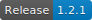

# PassMan


PassMan is a Python-based **pass**word **man**agement console application. Data is managed using Peewee ORM and stored in a Sqlite3 database.

### Dependencies
* Python3
  * Check version using `$ python --version`
  * <a href="https://www.python.org/downloads/release/python-365/">Installing or upgrading to Python3</a>
* <a href="http://docs.peewee-orm.com/en/latest/">PeeWee</a>
* <a href="https://pypi.org/project/bcrypt/">Bcrypt</a>
* <a href="https://pypi.org/project/colorama/">Colorama</a>
* <a href="https://pypi.org/project/termcolor/">Termcolor</a>

### Installation and Usage
```shell
$ git clone https://github.com/seanpierce/passman
$ cd passman
$ # install dependencies:
$ pip3 install peewee
$ pip3 install bcrypt
$ pip3 install colorama
$ pip3 install termcolor
$ # set privilages for main script
$ chmod +x passman.py
$ # run main script
$ ./passman.py
```

**Notes:**  
It's helpful to alias "python" and "pip" to point towards the "python3" and "pip3" commands respectively.
```shell
$ echo "alias python=python3" > ~/.bashrc
$ echo "alias pip=pip3" > ~/.bashrc
$ # for zsh users, replace .bachrc with .zshrc
```

**TODO:**
* Copy project to PATH, execute with single command 'passman'
* Package project and dependencies for offline installation
* Separate main menu functions into own module
* Add feature to copy current password to clipboard
* Update/delete passwords from database

**Author:**  
Sean Pierce Sumler

**License:**  
MIT, use at your own risk

For questions and comments please <a href="https://github.com/seanpierce/passman/issues/new">raise an issue</a>. <a href="https://github.com/seanpierce/passman/compare">Pull requests</a> always welcome, too. Thanks!
